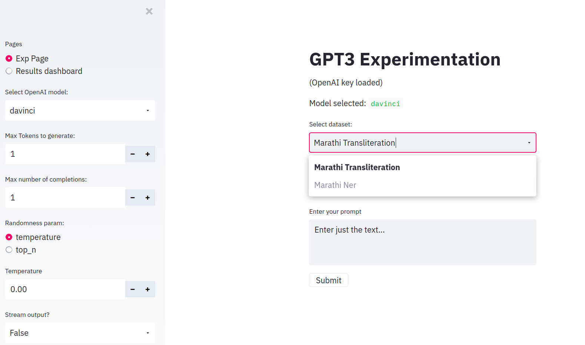

# gpt3-exp: Experimentation tool in Python for GPT3


__Note: You can view the video at [this location](https://www.loom.com/share/3384fc679e7e44e28d332dccf2802697)__

This streamlit application is a personal tool to help and manage experimentation with GPT3 API. The original GPT3 playground is nice, but lacks version control and ability to save outputs for comparison.

I made a small `streamlit` application that helps to manage it. Right now one can add `primes` or small datasets needed to prime the `Completion` API. This repo contains these `primes` in `src/gpt3_exp/datasets`.

## Setup

- Add your OpenAI key to `gpt3_exp/gpt3_config.yml` in this format:

```yaml
GPT3_API: ab-XXXXXXXXXXXXXXXXXXXXXXXX
```

- Or you can add it via the `streamlit` app directly.
- Install `poetry`. Follow the [official site](https://python-poetry.org/docs/#installation) or [this cookbook](https://soumendra.gitbook.io/deeplearning-cookbook/setting-up/setting-up-poetry-for-your-project)
- Once `poetry` is installed, run `poetry install`. This will download all the packages needed (ideally in `.venv`) as well as setup the repository.
- To run migrations: `poetry run migrate`

## Running the application

- To run the `streamlit` app: `poetry run st-server`
- You will now be able to view the application @ `localhost:8000`

## Adding new primes/dataset

- Create a `task.yml` file in `gpt3_exp/datasets`, this file would be available in the `streamlit` app in the dropdown



## Roadmap

- [x] Experimentation dashboard
- [x] Save results to DB
- [ ] Add search api to experimentation dashboard
- [ ] Create overview dashboard based off DB

## Other Resources

- GPT3 Fine Tuning: [Github Link](https://github.com/cabhijith/GPT-3_Docs/blob/master/Fine-Tune.md)

PRs are welcomed. Would be happy to help out with any issues :)
